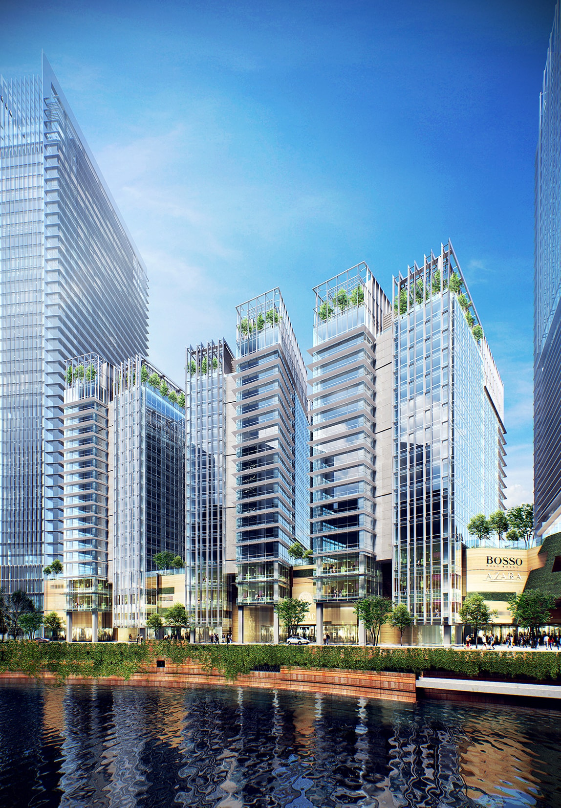
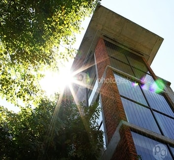
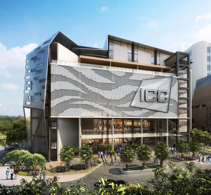

<section id="cd-timeline" class="cd-container">
  

    

      
1

    

    

      <h2>KL Eco City by SP Setia Bhd.</h2>
      
        
      
      

        Mixed Development consists of 4 office towers, 12 boutique offices, 3 serviced apartments, a hotel & retail
        mall. Contract value of RM4 bil.
      

      
        <h3>
          GDP ARCHITECTS SDN BHD 
          PROJECT ARCHITECT 
          DEC '09 - APR '11
        </h3>
      
    

  

  

    

      
2

    

    

      <h2>Tamarind Square in Cyberjaya by Tujuan Gemilang Sdn Bhd</h2>
      
        
      
      

        A commercial development comprising retail, offices & a serviced apartment block. A new architectural approach
        towards tropical retail experience in Malaysia. Contract value of RM220 mil.
      

      
        <h3>
          GARIS ARCHITECT SDN BHD 
          PROJECT ARCHITECT 
          MAY '11 - JAN '17
        </h3>
      
    

  

  

    

      
3

    

    

      <h2>Integrated Commercial Complex (ICC) in KL by 1Malaysia Development Bhd joint venture with DBKL</h2>
      
        
      
      

        A relocation project of Pasar Baru Bukit Bintang, to allow for TRX development. Contract value of RM60 mil.
      

      
        <h3>
          GARIS ARCHITECT SDN BHD 
          PROJECT ARCHITECT 
          MAY '11 - JAN '17
        </h3>
      
    

  

</section>
